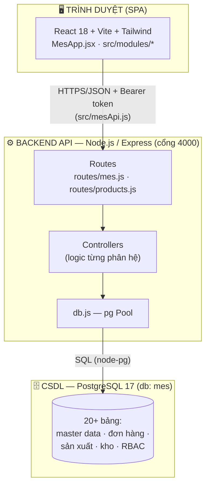
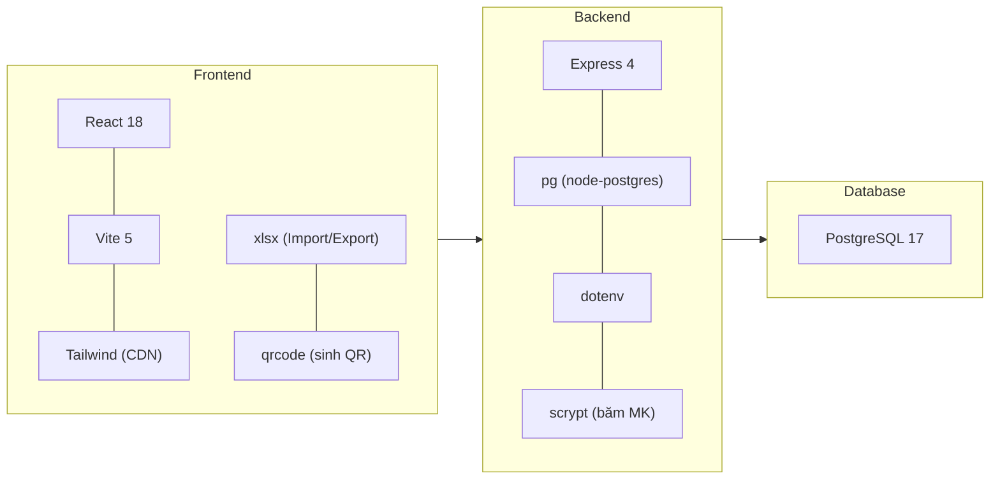
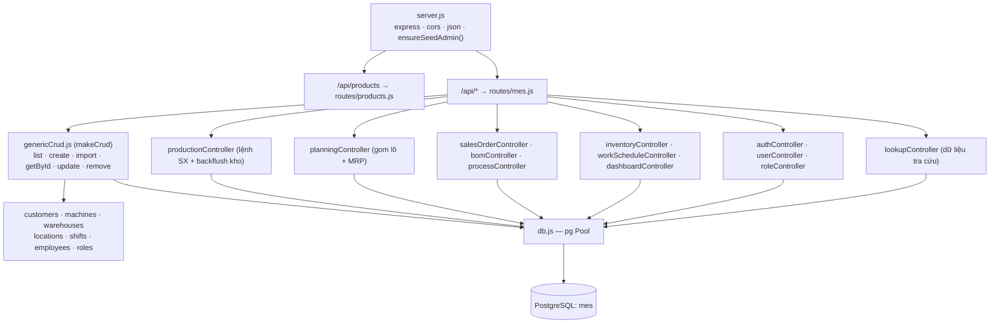
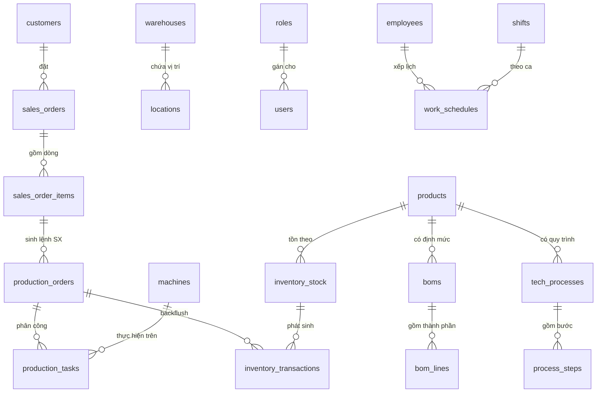
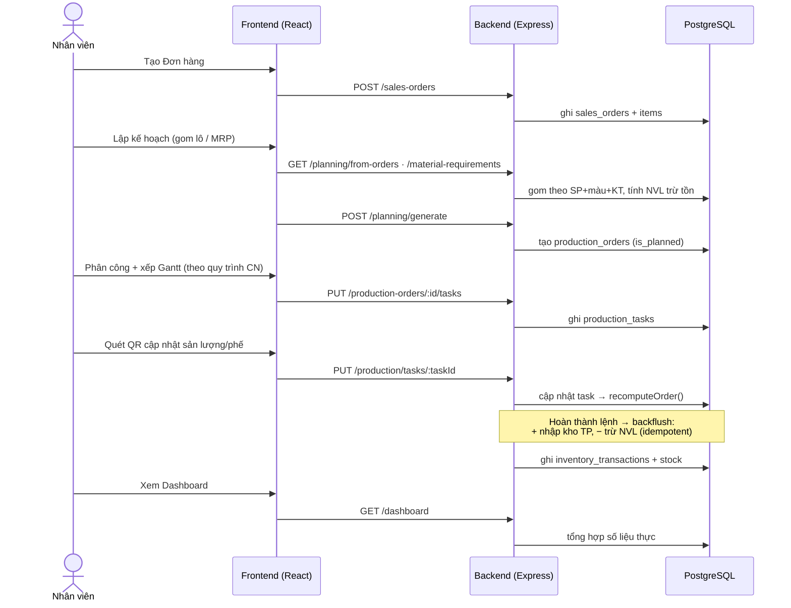
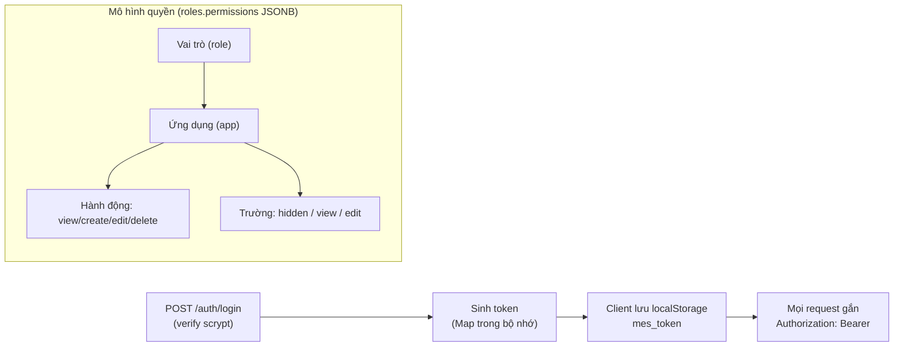
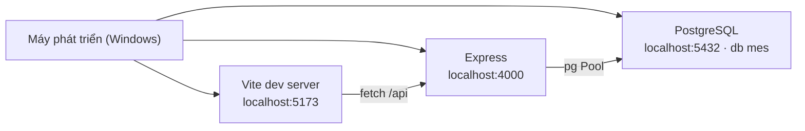

# Kiến trúc hệ thống — MES Bao Bì Ngọc An Thư

Tài liệu mô tả kiến trúc tổng thể của hệ thống MES: phân lớp, thành phần, luồng dữ liệu, mô hình CSDL, bảo mật và triển khai.

---

## 1. Tổng quan kiến trúc (3 lớp)

Hệ thống theo mô hình **client – server – database** kinh điển: SPA React gọi REST API (Express), API thao tác trên PostgreSQL.



| Lớp | Công nghệ | Cổng | Trách nhiệm |
|---|---|---|---|
| **Frontend** | React 18, Vite 5, Tailwind CSS | 5173 | Giao diện, định tuyến nội bộ, áp phân quyền hiển thị |
| **Backend** | Node.js, Express 4 | 4000 | REST API, nghiệp vụ, xác thực, truy vấn CSDL |
| **Database** | PostgreSQL 17 | 5432 | Lưu trữ dữ liệu, ràng buộc toàn vẹn |

---

## 2. Ngăn xếp công nghệ



---

## 3. Kiến trúc Frontend

SPA một trang, điều hướng bằng `state` (không dùng router ngoài). Mỗi phân hệ là một module trong `src/modules/`.

```mermaid
flowchart TB
    main["main.jsx"] --> App["MesApp.jsx<br/>(Sidebar + định tuyến view + PermProvider)"]
    App --> Login["Login.jsx<br/>(cổng đăng nhập)"]
    App --> Mods["src/modules/*"]

    subgraph Mods["Các module nghiệp vụ"]
      M1["Orders · Planning · Production"]
      M2["Bom · Process · Inventory"]
      M3["MasterData · Users · Permissions"]
      M4["QrLabels · QrScan · WorkSchedule · ProductionGantt"]
    end

    subgraph Shared["Hạ tầng dùng chung (src/)"]
      API["mesApi.js — http() + Bearer token<br/>resource() · production · planning ..."]
      PERM["perm.jsx — PermProvider / usePerm<br/>can(app,action) · fperm(app,field)"]
      CMP["components.jsx — PageHeader · ListHeader<br/>Section · usePager/Pagination"]
      UI2["ui.js — inputCls · fmt · statusClass"]
    end

    Mods --> API
    Mods --> PERM
    Mods --> CMP
```



**Điểm chính:**
- **Định tuyến**: `MesApp` giữ `view` hiện tại, đổi màn bằng `setView`; Sidebar lọc menu theo quyền (`canSee`).
- **Gọi API**: tập trung ở `src/mesApi.js` — `http()` tự gắn `Authorization: Bearer <token>` (token lưu `localStorage` key `mes_token`). Mẫu `resource(name)` sinh CRUD chuẩn cho mọi danh mục.
- **Phân quyền hiển thị**: `PermProvider` bọc toàn app; `usePerm()` cho `can(app, action)` và `fperm(app, field)` → ẩn/khóa nút và trường.
- **Thành phần dùng lại**: `PageHeader`/`ListHeader` (header dính), `Section`, `usePager` (phân trang 10/15/20 + hàng lấp đầy).

---

## 4. Kiến trúc Backend

`server.js` mount 2 router; phần lớn nghiệp vụ nằm ở `routes/mes.js` → ủy thác cho các controller. Danh mục dùng **CRUD factory** (`genericCrud.js`); nghiệp vụ phức tạp có controller riêng.



**Điểm chính:**
- **`genericCrud.makeCrud`**: nhà máy tạo CRUD + `bulkCreate` (import Excel, bỏ qua dòng lỗi, trả `{inserted, failed, errors}`).
- **`mountCrud(path, crud)`**: tự đăng ký 6 route `GET/POST/POST :import/GET:id/PUT:id/DELETE:id`.
- **`db.js`**: `pg.Pool` đọc từ `.env`; ép kiểu DATE (1082) trả chuỗi thô để tránh lệch múi giờ.
- **`migrate.js`**: nạp tuần tự mọi `schema*.sql` để dựng/cập nhật lược đồ.
- **Seed**: `ensureSeedAdmin()` tạo `admin / admin123` khi chưa có người dùng.

---

## 5. Mô hình dữ liệu (nhóm bảng)



| Nhóm | Bảng tiêu biểu |
|---|---|
| **Danh mục** | products, customers, machines, warehouses, locations, shifts, employees |
| **Định mức / Quy trình** | boms, bom_lines, tech_processes, process_steps |
| **Bán hàng** | sales_orders, sales_order_items |
| **Sản xuất** | production_orders, production_tasks |
| **Kho** | inventory_stock, inventory_transactions |
| **Nhân sự** | work_schedules |
| **Phân quyền** | roles (permissions JSONB), users |

---

## 6. Luồng nghiệp vụ cốt lõi

Vòng đời khép kín từ đơn hàng đến tồn kho và dashboard.



**Cơ chế đáng chú ý — Backflush tồn kho:** khi một lệnh SX hoàn thành, `recomputeOrder()` tự động **nhập thành phẩm** và **trừ nguyên vật liệu** theo BOM, có cờ `inventory_posted` để **chống ghi trùng**.

---

## 7. Xác thực & Phân quyền (RBAC)



- **Băm mật khẩu**: `scrypt`; danh sách tài khoản **không bao giờ** trả `password_hash`.
- **Quyền 3 cấp**: Vai trò → Ứng dụng → (Hành động + từng Trường), lưu ở cột `permissions` (JSONB) của bảng `roles`.
- **Thực thi phía client**: ẩn menu/nút theo `can()`, khóa/ẩn trường bằng `fperm()` + `<fieldset disabled>`.
- **Lưu ý**: hiện kiểm soát quyền ở **client**; có thể bổ sung middleware kiểm tra ở server nếu cần siết chặt.

---

## 8. Triển khai (môi trường phát triển)



| Thành phần | Lệnh chạy | Ghi chú |
|---|---|---|
| Database | (PostgreSQL service) | tạo db `mes`, cấu hình trong `backend/.env` |
| Migrate | `cd backend && npm run migrate` | nạp `schema*.sql` |
| Backend | `cd backend && npm run dev` | API cổng 4000, seed admin |
| Frontend | `npm run dev` | UI cổng 5173 |

**Định hướng nâng cấp khi lên production:** build frontend tĩnh (`vite build`) phục vụ qua Nginx; chạy backend sau reverse proxy (HTTPS); chuyển token sang JWT/redis thay vì Map bộ nhớ; thêm kiểm tra quyền phía server; sao lưu PostgreSQL định kỳ.

---

## 9. Sơ đồ thư mục rút gọn

```
files/
├── MesApp.jsx              # App gốc: Sidebar, định tuyến, ProductList, Dashboard
├── index.html              # Tailwind config + thương hiệu
├── src/
│   ├── main.jsx
│   ├── mesApi.js           # Lớp gọi API (Bearer token)
│   ├── perm.jsx            # RBAC phía client
│   ├── components.jsx      # PageHeader/ListHeader/Section/usePager
│   ├── ui.js               # tiện ích giao diện
│   └── modules/            # Orders, Planning, Production, Bom, Process,
│                           # Inventory, MasterData, Users, Permissions,
│                           # QrLabels, QrScan, WorkSchedule, ProductionGantt
└── backend/
    ├── server.js           # Express entrypoint
    ├── db.js · migrate.js
    ├── routes/             # mes.js, products.js
    ├── controllers/        # logic từng phân hệ + genericCrud.js
    └── schema*.sql         # lược đồ CSDL theo phiên bản
```
