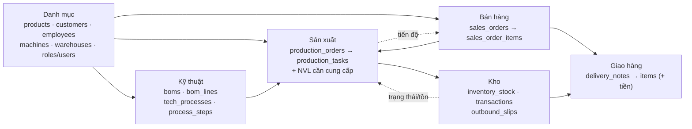
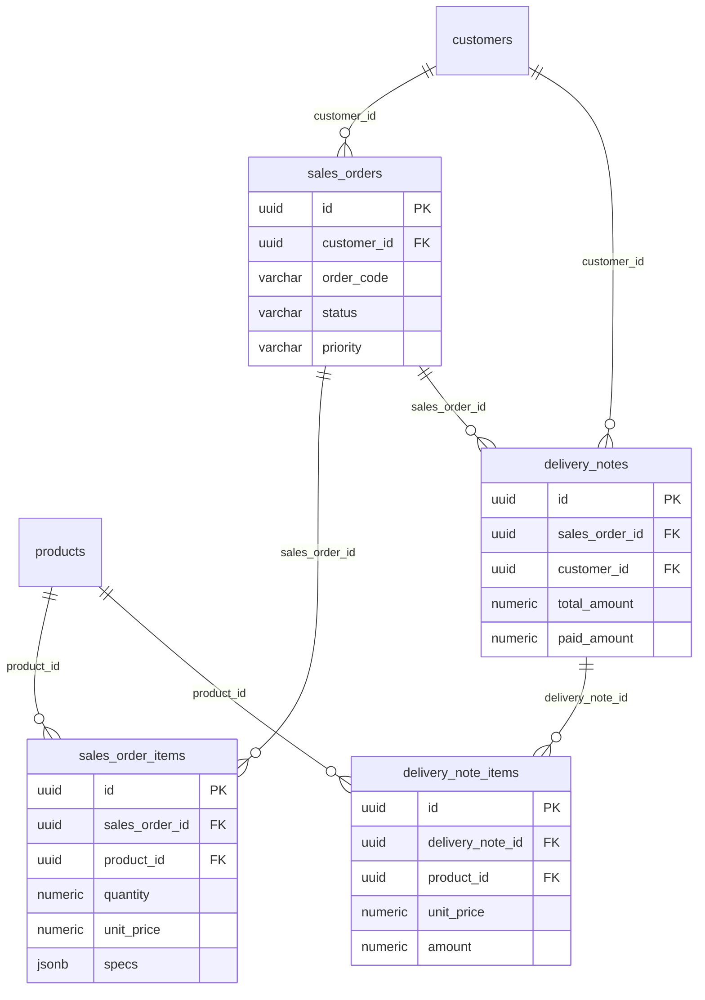
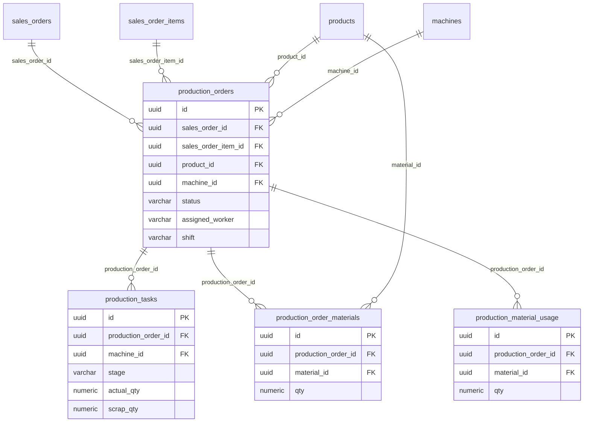
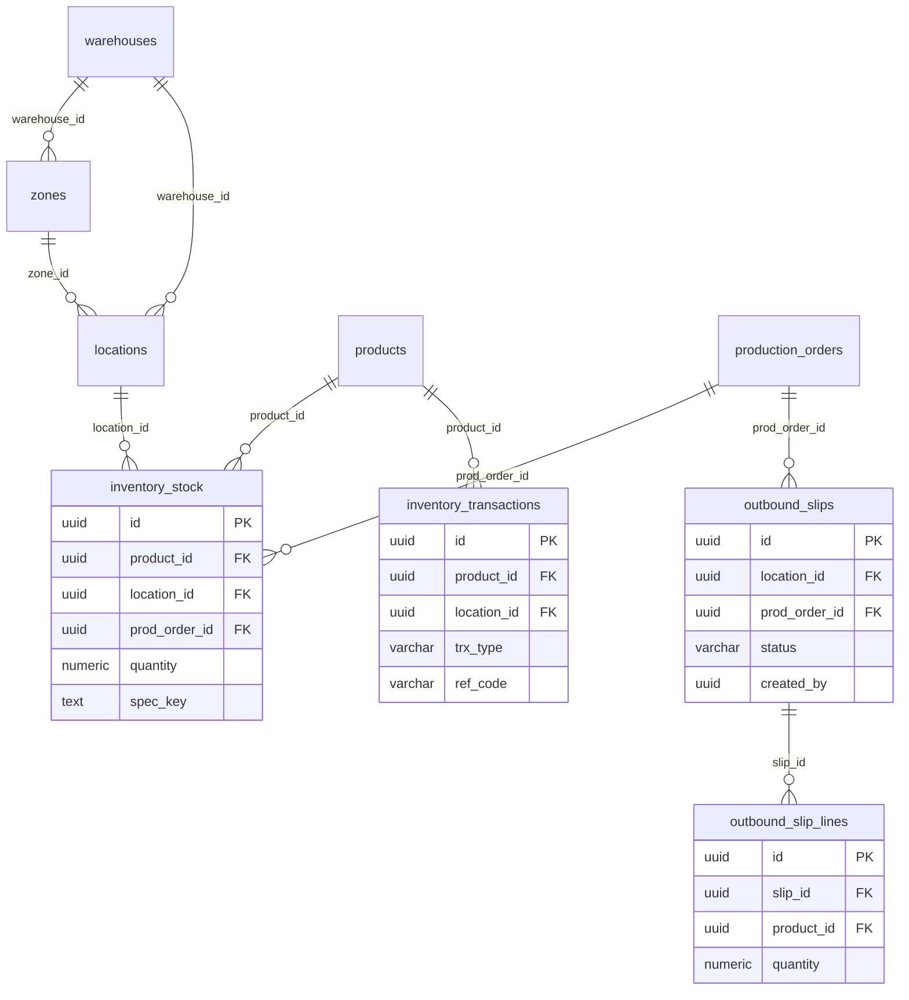
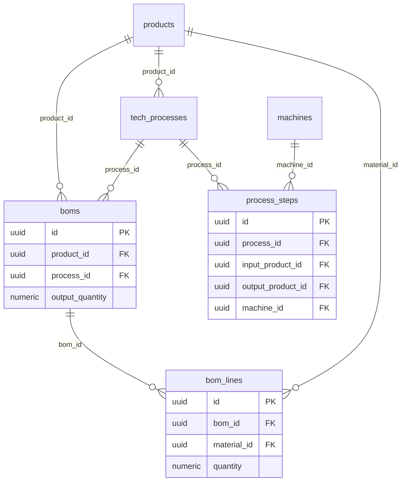
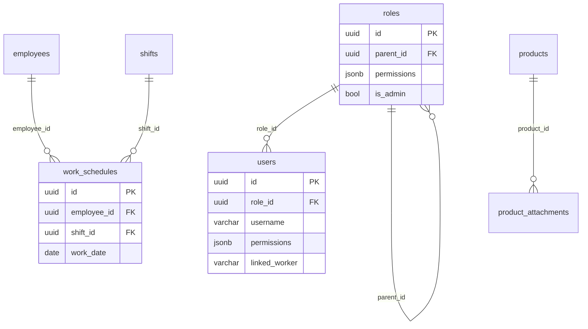

# Bản đồ & rà soát cơ sở dữ liệu MES

> Trích xuất trực tiếp từ PostgreSQL `mes` tại thời điểm rà soát: **28 bảng · 28 khóa chính (uuid) · 44 khóa ngoại · 6 nhóm nghiệp vụ**.
> Bản đồ trực quan (có màu, đổi sáng/tối): https://claude.ai/artifact/RbLmZenX7ba8vzSwX3hYGC
> ⚠️ Đây là ảnh chụp — kiểm lại với code hiện hành trước khi refactor lớn.

## 1. Sơ đồ tổng quan — dòng dữ liệu giữa các nhóm

## 2. ERD theo module (PK / FK)

### A · Bán hàng & Giao hàng

### B · Sản xuất

### C · Kho

### D · Kỹ thuật (BOM & Quy trình)

### E · Danh mục nền & Người dùng

## 3. Quan hệ trục chính

| Từ bảng | Quan hệ | Đến bảng | Khóa ngoại | Ý nghĩa |
|---|---|---|---|---|
| sales_order_items | 1→N | production_orders | sales_order_item_id | Dòng đơn sinh lệnh SX |
| production_orders | 1→N | production_tasks | production_order_id | Lệnh chia phân công (công đoạn) |
| production_orders | 1→N | production_order_materials | production_order_id | NVL cần cung cấp (kế hoạch) |
| production_orders | 1→N | outbound_slips | prod_order_id | Phiếu xuất kho NVL cho lệnh |
| production_orders | 1→N | inventory_stock | prod_order_id | Tồn theo lô = mã lệnh SX |
| sales_orders | 1→N | delivery_notes | sales_order_id | Đơn → phiếu giao (có tiền) |
| products | 1→N | ~10 bảng | product_id / material_id | Trung tâm: SP · NVL · BTP · TP |
| warehouses | 1→N | zones → locations | warehouse_id / zone_id | Cây kho: kho › khu vực › vị trí |
| roles | 1→N | roles (self) | parent_id | Kế thừa quyền theo cây vai trò |

## 4. Điểm logic lủng củng / rủi ro

### 🔴 Cao — Schema & migration chưa sạch
`backend/migrations/schema_consolidated.sql` bị **lỗi mã hóa tiếng Việt** (mojibake) và **thiếu nhiều cột**: `priority`, `material_type`, `mix_ratio`, `machine_ids`, `posted_qty`, `materials_issued`, `unit_price`, các bảng `outbound_slips*`… đều thêm bằng **ALTER trực tiếp**, không nằm trong file gốc. `migrate.js` chỉ nạp đúng file này.
→ **Hệ quả:** dựng DB mới từ đầu (khi lên server) dễ vỡ / thiếu cột.

### 🟠 Vừa — Nhân sự / tổ / ca lưu bằng TEXT, không FK
`production_orders` & `production_tasks` dùng `assigned_worker`, `assigned_team`, `shift` là chuỗi tên; `users.linked_worker`, `employees.factory` cũng vậy — dù đã có bảng `employees`, `shifts`.
→ Đổi tên nhân viên là đứt liên kết; **KPI theo người dễ sai** (đúng chỗ remote vừa phải sửa).

### 🟠 Vừa — Thuộc tính lưu 3 kiểu song song
Cùng một thông số tồn tại ở `specs` (jsonb) + `spec_key` (text) + `attr_size/attr_thickness/attr_color`, lặp trên 4 bảng (sales_order_items, production_orders, inventory_stock, inventory_transactions).
→ Phải đồng bộ cả 3 mỗi lần ghi (`buildSpecKey`/`legacyAttrs`) → dễ lệch.

### 🟠 Vừa — Nhiều luồng biến động kho
Tồn bị thay đổi bởi: backflush khi SX xong (`syncOrderInventory`), phiếu `outbound_slips`, điều chỉnh thủ công, và giao hàng. `production_material_usage` giờ **chỉ ghi nhận** (không trừ) sau khi tách logic.
→ Khó suy luận tồn đúng/sai; dễ trừ trùng nếu sửa một nhánh mà quên nhánh khác.

### 🟡 Thấp
- **status gộp nhiều vòng đời**: `sales_orders.status` trộn SX + giao + thanh toán; enum bằng text, CHECK chỉ có ở `production_orders`.
- **Thiếu index FK** (PG không tự tạo) & **FK còn thiếu**: `outbound_slips.created_by` chưa FK tới `users`; `ref_code` là text tự do.
- **Quyền lưu 2 nơi**: `roles.permissions` + `users.permissions` + `is_admin` + `parent_id` → phức tạp, merge ở backend.
- **Đặt tên chưa nhất quán**: `production_material_usage.qty` vs `quantity`; soft-delete không đồng nhất giữa bảng cha/con.

## 5. Đề xuất tối ưu (theo thứ tự ưu tiên)

**Trước khi deploy**
1. **Làm sạch migration/schema**: tái tạo `schema_consolidated.sql` bằng `pg_dump` đúng UTF-8 từ DB đang chạy (đủ mọi cột/bảng), hoặc chuyển sang migration tăng dần. **Bắt buộc test dựng DB mới từ số 0** trước khi lên server.

**Nên làm**
2. **Chuẩn hóa nhân sự/ca về FK** (`employee_id`, `shift_id`). Nếu chưa đổi schema lớn: tối thiểu bắt buộc chọn từ danh sách + validate + ánh xạ id ở tầng báo cáo để KPI chính xác.
3. **Gom một đầu mối cho biến động kho**: mọi cộng/trừ tồn qua một service chung (ghi `inventory_transactions` + cập nhật `inventory_stock`).

**Khi rảnh**
4. Thống nhất thuộc tính về `specs` + `spec_key` (coi `attr_*` là legacy chỉ đọc).
5. Thêm index cho cột FK hay join/lọc; thêm FK `outbound_slips.created_by → users`.
6. Tách `status` sản xuất vs thanh toán; thêm CHECK/enum dùng chung.
7. Đơn giản hóa phân quyền nếu không dùng override cấp user; thống nhất tên cột (`qty → quantity`).
